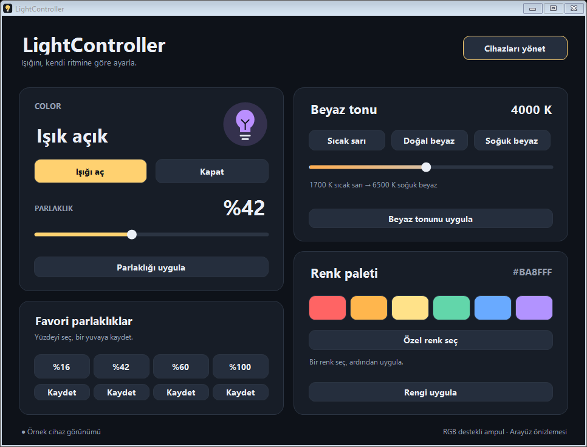
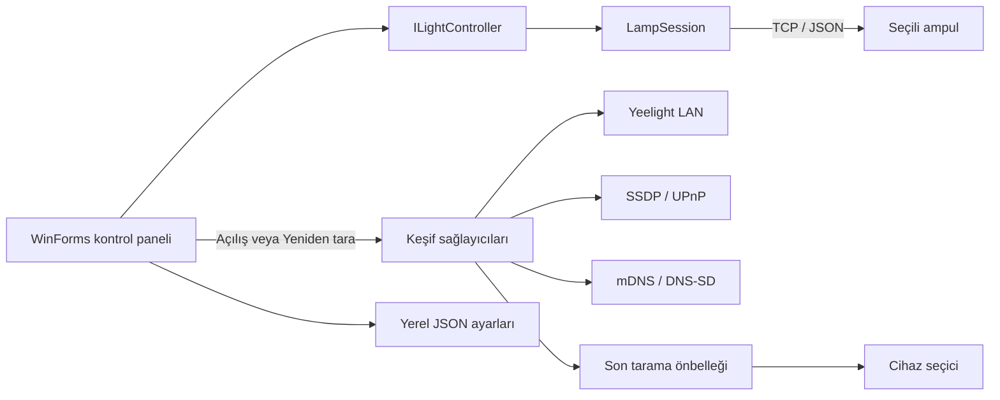

<p align="center">
  
</p>

<h1 align="center">LightController</h1>
<p align="center">Windows için yerel ağ üzerinden akıllı ampul kontrolü.</p>
<p align="center">
  
  
  
  
</p>

LightController, desteklenen akıllı ampulleri bilgisayardan açıp kapatmak,
parlaklıklarını ayarlamak ve donanım destekliyorsa renklerini değiştirmek için
geliştirilmiş taşınabilir bir Windows uygulamasıdır. Işık komutlarını yerel ağ
üzerinden doğrudan cihaza gönderir; bulut hesabı ya da uygulamaya ait bir sunucu gerektirmez.

Bu repo **4.1 tabanlı C# / WinForms sürümünü** içerir. Birden fazla cihazı keşfeder,
ancak aynı anda **seçili tek ampulü** kontrol eder.



*Görsel, gerçek uygulama kontrolleriyle üretilmiş örnek RGB cihaz görünümüdür;
canlı bir cihaz ölçümü değildir.*

## İçindekiler

- [Özellikler](#özellikler)
- [Kullanılan teknolojiler](#kullanılan-teknolojiler)
- [Desteklenen cihazlar](#desteklenen-cihazlar)
- [Kurulum ve kullanım](#kurulum-ve-kullanım)
- [Kaynak koddan derleme](#kaynak-koddan-derleme)
- [Nasıl çalışıyor?](#nasıl-çalışıyor)
- [Proje yapısı](#proje-yapısı)
- [Testler](#testler)
- [Sınırlar ve sorun giderme](#sınırlar-ve-sorun-giderme)
- [Katkı ve teşekkür](#katkı-ve-teşekkür)

## Özellikler

- **Aç / kapat:** ilave ışık geçiş animasyonu olmadan güç komutu.
- **Parlaklık:** %1–100 aralığı ve ayrı uygulama düğmesi.
- **Dört favori:** seçilen parlaklığı kaydetme ve tek tıkla uygulayıp ampulü açma.
- **Beyaz tonu:** destekleyen modellerde 1700–6500 K; sıcak, doğal ve soğuk hazır değerler.
- **RGB:** hazır palet ve özel renk seçimi. Desteklemeyen modellerde kontroller pasiftir.
- **Cihaz keşfi:** Yeelight LAN, SSDP/UPnP ve mDNS/DNS-SD sağlayıcıları.
- **Kontrollü tarama:** yalnızca açılışta ve **Yeniden tara** düğmesiyle ağ taraması.
- **Bağlantıyı koruma:** komutlar arasında açık TCP bağlantısı ve bilinen adrese yeniden bağlanma.
- **Yerel ayarlar:** seçilen cihaz ve favorilerin JSON dosyasında tutulması.
- **Sistem tepsisi:** pencereyi gizleme, geri açma ve çıkış menüsü.
- **Koyu arayüz:** özel çizilmiş kartlar, düğmeler, kaydırıcılar ve ampul göstergesi.

## Kullanılan teknolojiler

| Teknoloji | Projedeki görevi |
| --- | --- |
| **C#** | Uygulama mantığı, cihaz modelleri ve ağ işlemleri |
| **.NET Framework** | Windows masaüstü çalışma zamanı ve standart kütüphaneler |
| **Windows Forms** | Ana pencere, cihaz seçimi, olaylar ve sistem tepsisi |
| **System.Drawing / GDI+** | Yuvarlatılmış kartlar, özel kontroller ve durum simgelerinin çizimi |
| **System.Net.Sockets** | UDP keşfi ve TCP üzerinden ampul komutları |
| **Task / async-await / SemaphoreSlim** | Ağ işlemlerini arayüzden ayırma ve seçili cihazın işlemlerini sıralama |
| **JavaScriptSerializer** | JSON protokol mesajları ve yerel ayarların serileştirilmesi |
| **Windows IP Helper / SendARP** | Gerektiğinde yerel cihaz kimliği için MAC çözümleme |
| **PowerShell** | Tek komutla derleme ve test çalıştırma |
| **GitHub Actions** | Windows üzerinde derleme/test ve taşınabilir çıktı oluşturma |

Uygulama harici NuGet paketleri, Node.js, Electron, Python veya bir web sunucusu kullanmaz.
RGB ve beyaz tonu yetenekleri cihazın keşif yanıtından okunur; arayüzün görünmesi tek
başına donanımın bu özelliklere sahip olduğu anlamına gelmez.

## Desteklenen cihazlar

| Cihaz / protokol | Keşif | Kontrol |
| --- | --- | --- |
| Yeelight LAN destekli ampuller | Evet | Aç/kapat ve parlaklık; destekliyorsa RGB / Kelvin |
| SSDP / UPnP duyurusu yapan cihazlar | Evet | Uygun HTTP(S) adresi duyurulmuşsa web arayüzünü açma |
| mDNS / DNS-SD hizmetleri | Uygun yanıt alınırsa | HTTP(S) hizmetlerinde web arayüzünü açma |
| Matter / HomeKit gibi farklı protokoller | Bazı hizmet duyuruları bulunabilir | Eşleştirme ve doğrudan kontrol uygulanmadı |

**Ağda bulunmak, kontrol edilebilmekle aynı şey değildir.** Mevcut ışık sürücüsü
Yeelight LAN protokolünü kullanır. Sabit beyaz modellerde RGB veya
ayarlanabilir beyaz sıcaklığı yazılımla eklenemez.

## Kurulum ve kullanım

### Gereksinimler

- Windows 10/11 ve etkin .NET Framework; .NET Framework 4.8 veya üstü önerilir.
- Bilgisayar ile ampulün aynı yerel ağda olması.
- Ampulde **LAN Control / LAN Kontrolü** seçeneğinin açık olması.
- Ampulün fiziksel elektrik bağlantısının açık kalması.

### İlk çalıştırma

1. Kaynak kodu aşağıdaki komutlarla derle.
2. `dist/LightController/LightController.exe` dosyasını aç.
3. İlk ağ taramasının tamamlanmasını bekle.
4. **Cihazları yönet** ekranında ampulü seçip **Işığı kontrol et** düğmesine bas.
5. Güç, parlaklık ve desteklenen renk kontrollerini kullan.

İlk çalıştırmada sabit bir ev ağı IP'si varsayılmaz; kullanılacak ampul kullanıcı tarafından seçilir.
IP değişirse **Yeniden tara** düğmesiyle listeyi güncelle.

Herhangi bir kurulum sihirbazı gerekmez. Uygulamanın bulunduğu klasör yazılabilir olmalıdır.
Derleme iş akışı başarılı olduğunda Actions çalıştırmasının **Artifacts** bölümünde
`LightController-windows` paketi de bulunabilir.

**[Ayrıntılı kullanım kılavuzu →](docs/KULLANIM.md)**

## Kaynak koddan derleme

Repo kökünde PowerShell aç:

```powershell
git clone https://github.com/erenozhan95/LightController.git
cd LightController
.\scripts\build.ps1
```

Betik, Windows'taki .NET Framework C# derleyicisini bulur ve tek bir `winexe` üretir.
Visual Studio veya ayrı bir paket yöneticisi gerektirmez.

```text
dist/LightController/
├── LightController.exe
├── KULLANIM.md
├── THIRD_PARTY_NOTICES.md
└── third-party/
```

İlk kullanımda bu klasörün yanında `Ayarlar/ayarlar.json` oluşur. Bu dosya ve derleme
çıktıları Git tarafından izlenmez. Kendi cihaz bilgilerini repo içine ekleme.

## Nasıl çalışıyor?



1. Açılışta keşif sağlayıcıları çalışır ve sonuçlar ortak listeye alınır.
2. Cihaz seçildiğinde `LampSession` üzerinden kontrol edilir.
3. Her komut benzersiz bir JSON istek kimliğiyle TCP bağlantısından gönderilir.
4. Aynı bağlantı sonraki komutlarda yeniden kullanılır. Yeniden bağlanma, ağ taraması başlatmaz.
5. Durum 10 saniyelik zamanlayıcıyla okunur. Bu işlem cihaz keşfi değildir.
6. Pencere küçültüldüğünde sistem tepsisine geçer; bağlantı arka planda devam eder.

Keşif ve protokol ayrıntıları: **[Mimari ve ağ iletişimi](docs/ARCHITECTURE.md)**.

## Proje yapısı

```text
LightController/
├── src/
│   ├── LightController.cs     # Model, ayarlar, TCP oturumu ve uygulama akışı
│   ├── Dashboard.cs           # Özel çizimli WinForms arayüzü
│   ├── Discovery.cs           # Yeelight keşfi ve cihaz kimliği
│   ├── NetworkDiscovery.cs    # Genel SSDP/mDNS sağlayıcıları
│   └── DevicePicker.cs        # Önbellekli cihaz seçimi ve elle IP girişi
├── assets/                    # Uygulama simgeleri
├── docs/                      # Kullanım, mimari ve örnek ekran görüntüsü
├── scripts/                   # Derleme / test betikleri
├── tests/                     # Sahte cihaz ve arayüz doğrulamaları
├── third-party/               # Kaynak alınan projelerin lisansları
└── .github/                   # Windows CI ve katkı şablonları
```

## Testler

```powershell
.\scripts\test.ps1
```

- **TestDashboard:** RGB/Kelvin komut parametreleri, desteklenmeyen özelliklerin engellenmesi,
  favori kaydı ve mono/RGB/yalnız-Kelvin arayüz durumları.
- **TestScanPolicy:** bağlantının yeniden kullanılması, bağlantı kopunca yeniden deneme,
  komut sırasında keşif yapılmaması, cihaz seçicinin önbelleği kullanması.
- **TestGeneral:** SSDP ve DNS kayıtlarının ayrıştırılması, bozuk DNS paketlerinin reddi,
  protokol birleştirme ve yanlış cihaza ışık kontrolleri sunulmaması.

Testler loopback üzerinde sahte TCP cihazları kullanır; evdeki ampullerin ayarlarını
değiştirmez. Görsel çıktılar ve geçici ayarlar `artifacts/tests/` altına yazılır.
RGB komutlarının protokol testleri, her fiziksel modelin doğrulandığı anlamına gelmez.

## Sınırlar ve sorun giderme

- Aynı anda **tek seçili ampulün** bağlantısı yönetilir. Birden fazla ampule eşzamanlı
  bağlantı bu sürümün kapsamı dışındadır.
- Dört parlaklık kaydı uygulama genelindedir; ampul başına ayrı kayıt tutulmaz.
- Durum, her özellik bildirimiyle anında işlenmek yerine periyodik sorgularla güncellenir.
- IP çalışma sırasında değişirse kullanıcı taramayı yenilemelidir.
- İlk tarama birkaç saniye sürebilir. Komutlar keşif işlemini tekrar başlatmaz;
  gerçek yanıt süresi ağ ve ampul yazılımına bağlıdır.
- Misafir ağı, istemci izolasyonu, VPN veya güvenlik duvarı keşfi engelleyebilir.
- Yerel protokol şifreleme veya uygulama içi kullanıcı doğrulaması sağlamaz;
  uygulama güvenilen ev ağı için tasarlanmıştır.
- Ağdaki her cihaz kendini duyurmadığından keşif listesi eksiksiz ağ envanteri değildir.

## Katkı ve teşekkür

Hata bildirimleri ve geliştirme önerileri için [Issues](https://github.com/erenozhan95/LightController/issues)
kullanılabilir. Değişiklik göndermeden önce [katkı rehberini](CONTRIBUTING.md) oku.

Yeelight UDP keşfi ve bazı komut parametrelerinde
**[EmreOzhan/smart-gadget](https://github.com/emreozhan/smart-gadget)** projesinden
yararlanılmıştır. Orijinal MIT lisansı ve ayrıntılar
[üçüncü taraf bildirimlerinde](THIRD_PARTY_NOTICES.md) korunmuştur.

Sürüm notları: [CHANGELOG.md](CHANGELOG.md).

## Lisans

Copyright © 2026 Eren Özhan. Proje [MIT lisansı](LICENSE) ile yayımlanır.
Üçüncü tarafların kendi lisans ve telif bildirimleri ayrıca geçerlidir.
